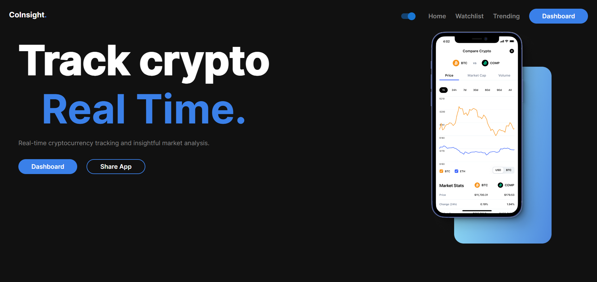

# Coinsight

### Track crypto in Real Time

Coinsight is a real-time cryptocurrency tracking and insightful market analysis web application. Built with React, Chart.js, Material-UI, and Framer Motion, this app provides an intuitive and interactive experience for users to monitor and compare various cryptocurrencies.



## Features

- **Real-Time Cryptocurrency Tracking**: Get the latest updates on cryptocurrency prices and market data.
- **Market Analysis**: Insightful analysis with visualizations using Chart.js.
- **Interactive Dashboard**: Easily navigate through different sections like Dashboard, Watchlist, and Trending.
- **Responsive Design**: Seamlessly works across different devices and screen sizes.
- **Smooth Animations**: Experience smooth transitions and animations with Framer Motion.
- **Light/Dark Mode**:Switch smoothly between light and dark modes.

## Technologies Used

- **React**: A JavaScript library for building user interfaces.
- **Chart.js**: A flexible JavaScript charting library for designers & developers.
- **Material-UI**: React components for faster and easier web development.
- **Framer Motion**: A production-ready motion library for React.

## Installation

1. **Clone the repository**:
   ```sh
   git clone https://github.com/your-username/coinsight.git
   cd coinsight
   ```

2. **Install dependencies**:
   ```sh
   npm install
   ```

3. **Start the Application**:
   ```sh
   npm start
   ```
4. Open your browser and navigate to http://localhost:3000.

  ## Usage

- Dashboard: View an overview of the cryptocurrency market.
- Watchlist: Keep track of your favorite cryptocurrencies.
- Trending: See the most trending cryptocurrencies based on CoinGecko's trending data.

## API
  This application uses the CoinGecko API to fetch real-time cryptocurrency data.
  For more information, visit the CoinGecko API documentation.
 
## Contributing

  Contributions are what make the open-source community such an amazing place to learn, inspire, and create. Any contributions you make are greatly appreciated.

  - Fork the Project
  - Create your Feature Branch (git checkout -b feature/AmazingFeature)
  - Commit your changes (git commit -m 'Add some AmazingFeature')
  - Push to the Branch (git push origin feature/AmazingFeature)
  - Open a Pull Request

## License
Distributed under the MIT License. See LICENSE for more information.

## Contact

For any inquiries, please reach out to tripathitanu02@gmail.com.

Project Link: https://co-insight2.vercel.app/

### Made with ❤️ by Tanu Tripathi


   
